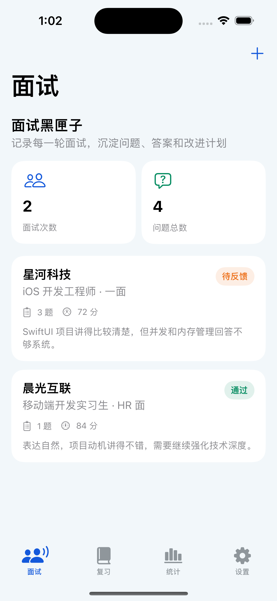
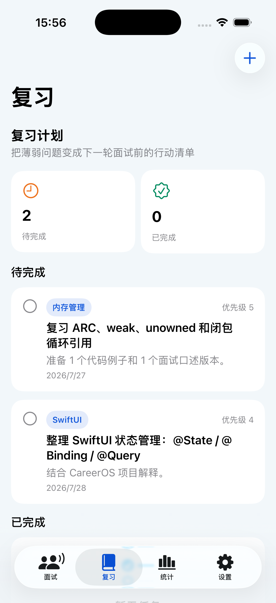
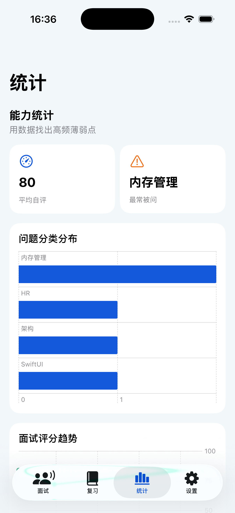
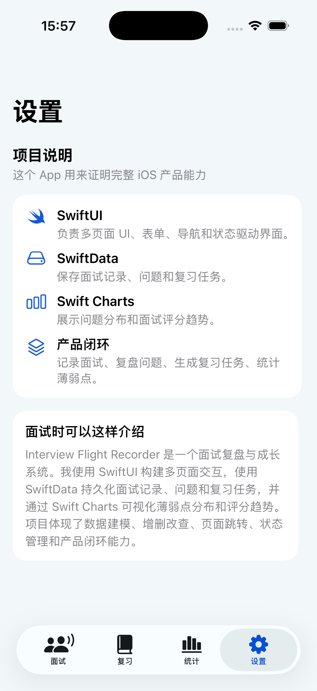

# Interview Flight Recorder

Interview Flight Recorder 是一个 iOS 面试复盘与成长系统，用来记录每次面试、沉淀面试问题、生成复习任务，并用图表分析薄弱点。

## 已实现功能

- 面试记录列表与公司名称搜索
- 新增、编辑、删除面试
- 面试详情页
- 面试问题新增、编辑、删除
- 问题分类：Swift、SwiftUI、UIKit、网络、并发、内存管理、架构、项目经验、算法、HR
- 复习计划：新增、编辑、删除、标记完成
- 统计页：问题分类分布图、面试评分趋势图
- 设置页：项目说明和面试介绍话术
- SwiftData 本地持久化
- Swift Charts 数据可视化

## 页面展示

| 面试列表 | 复习计划 | 数据统计 | 设置页面 |
|---|---|---|---|
|  |  |  |  |

更多新增、编辑、详情和任务状态截图见 [`页面展示截图`](./页面展示截图)。

## 项目文件结构

- `Interview_Flight_RecorderApp.swift`：App 入口和 SwiftData 容器
- `ContentView.swift`：底部 Tab 导航
- `Theme.swift`：颜色、面试结果、问题分类枚举
- `Models.swift`：SwiftData 数据模型
- `DataSeeder.swift`：首次启动默认数据
- `Components.swift`：公共 UI 组件
- `InterviewsView.swift`：面试列表和面试编辑
- `InterviewDetailView.swift`：面试详情和问题编辑
- `ReviewPlanView.swift`：复习计划
- `StatsView.swift`：统计图表
- `SettingsView.swift`：项目说明

## 如何运行

1. 用 Xcode 15.2 打开 `Interview Flight Recorder.xcodeproj`
2. 选择 iPhone 模拟器
3. 点击 Run

如果你之前运行过模板项目，遇到 SwiftData schema 相关错误，可以在模拟器中删除 App 后重新运行。

## 简历描述参考

Interview Flight Recorder - iOS 面试复盘与成长系统

使用 SwiftUI + SwiftData 构建面试记录与复盘 App，支持面试记录管理、问题分类、复习任务、能力短板统计和评分趋势图等功能。项目采用多文件结构拆分数据模型、页面、公共组件和种子数据，结合 Swift Charts 展示问题分类分布和面试评分趋势，体现了本地持久化、增删改查、状态管理、页面跳转和产品闭环能力。
